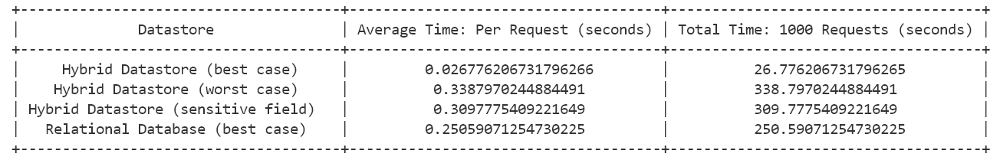
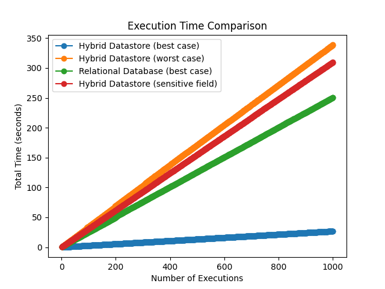
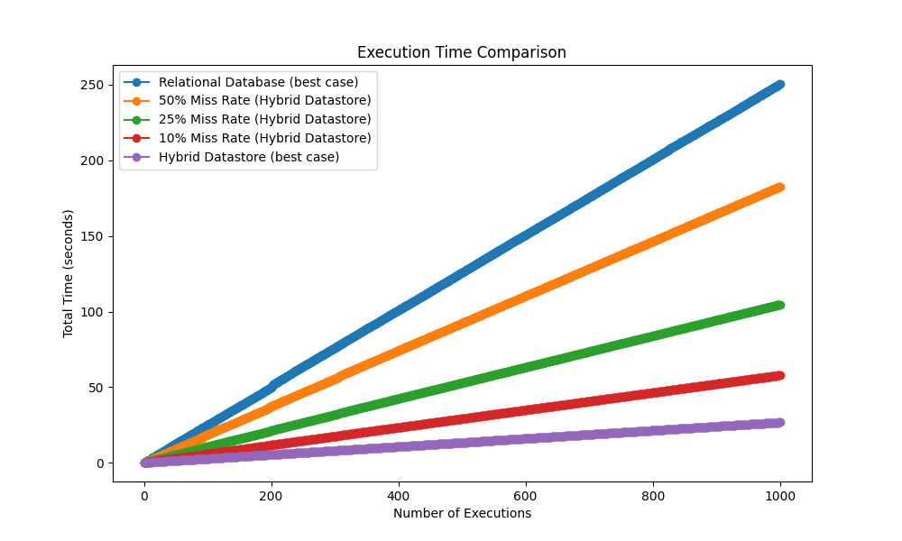

# HybridDatabase-metcs777

## Introduction

This project intends to explore the integration of relational and NoSQL solutions within hybrid cloud environments, focusing on AWS DynamoDB as a key component. The choice of this topic stems from my interest in the implementation details and performances of different database platforms. The speed needed to reach data is in the single digit millisecond range while the need for accounting and operations on existing RDBMS can’t be easily migrated. Research delve into the performance of the hybrid structure, investigating the strengths and weaknesses of such system and the intricate implementational detail to link the RDBMS and DynamoDB.

## Setup Python Environment

To set up the Python environment for this project, please follow these steps:

1. Make sure you have Python installed on your machine. If not, you can download it from the official Python website: [https://www.python.org/downloads/](https://www.python.org/downloads/)

2. Navigate to the root directory of this project.

3. Install the required dependencies by running the following command in your terminal or command prompt:

    ```shell
    pip install -r requirements.txt
    ```

## Environmental Variables

To ensure the proper functioning of the project, you need to set the following environmental variables in a `.env` file at the root directory of the repository:

- The aws credentials should be directly set in awscli or in the `~/.aws/credentials` file. The `~/.aws/credentials` file should look like this:

    ```shell
    [default]
    aws_access_key_id = YOUR_ACCESS_KEY
    aws_secret_access_key = YOUR_SECRET_KEY
    aws_session_token = YOUR_SESSION_TOKEN
    ```
 - Past use of environmental variables in the code has been removed due to some strange role issues with AWS Academy account. The code still need the variables to be present in the `.env` file but will not actually use them
 
1. ~~`ACCESS_KEY`~~: The access key ID for your AWS account.

2. ~~`SECRET_KEY`~~: The secret access key for your AWS account.

3. ~~`SESSION_TOKEN`~~: The session token for your AWS account.

4. `AWS_REGION`: The AWS region where you want to deploy the resources.

5. `NOSQL_NAME`: The table name of DynamoDB where you want to store the NoSQL data.

6. `DATABASE_NAME`: The database name of the AWS RDS with PostgreSQL.

7. `DATABASE_IDENTIFIER`: The identifier of your created AWS RDS.

8. `DATABASE_USERNAME`: The username of your AWS RDS with PostgreSQL.

9. `DATABASE_PASSWORD`: The password of your AWS RDS with PostgreSQL.

10. `DATABASE_ENDPOINT`: The endpoint of your AWS RDS with PostgreSQL. This will be created by the script provided, so there is no need to create it or enter it manually.

Make sure to keep the `.env` file secure and do not commit it to git to protect your sensitive information!!!!!!!


## Executing the Files

To execute the files in this repository, follow these steps:

1. Open your terminal or command prompt.

2. Navigate to the root directory of this project.

3. Run the files in `term-paper/code` Directory using the python interpreter with required packages. For example, to execute `DeployDatabases.py`, run the following command:

    ```shell
    python term-paper/code/DeployDatabases.py
    ```

## Order of Execution in `term-paper/code` Directory

When executing the files in the `term-paper/code` directory, it is recommended to follow the order below:

1. `DeployDatabases.py`: Responsible for deploying the required databases, including AWS RDS with PostgreSQL and DynamoDB and create aws security group to allow access to the created AWS RDS.

2. `LoadData_NOSQL.py`: This script loads some sample data into table in DynamoDB.

3. `LoadData_RDS.py`: This script loads some sample data into the relational database in AWS RDS with PostgreSQL.

4. `PerformanceEval.py`: This script evaluates the performance of the hybrid structure by measuring time needed for data retrieval and operations under various circumstances.

5. `CreateGraph.py`: This script creates graphs and visualizations based on the meassured performance of the hybrid structure under various circumstances.

6. `CleanUp.py`: This script cleans up and deletes the databases and resources created on AWS during the project execution.

---

- `CreateLambdaRole.py`: This file should be ignored, it was abandoned due to not able to create roles with AWS Academy account and thus no AWS Lambda function used.

- `term-paper/data/generate.py`: This file can be run if you want new random data rather then the provided ones. It generates 3000 rows of data for testing with some fields being unique such as CustomerID and email.

Make sure to execute the files in the specified order to ensure proper functionality and dependencies.

## Results

Here are three pictures generated during the performance evaluation of the hybrid datastore:





- The result from the performance eval shows that under the best circumstance, a NoSQL front can shorten time needed for data retrival to 1/10 of the time needed for data retrival with relational database alone.

- Under the worst circumstance, the system also have the possibility of performing worse than the relational database alone due to the need to retrive the data from relational database, add missing data to NoSQL front and serve customer info at the same time.

- Syncing information, sensitive information espetially, can cause the performace of the data base to decrease dramatically, but is needed to avoid wrong information due to data inconsistancy.



- Miss Rate can significantly impact the performance of the hybrid database. But it also show use possibilities of drastic performance improvement from relational databases even with a 50% miss rate.


